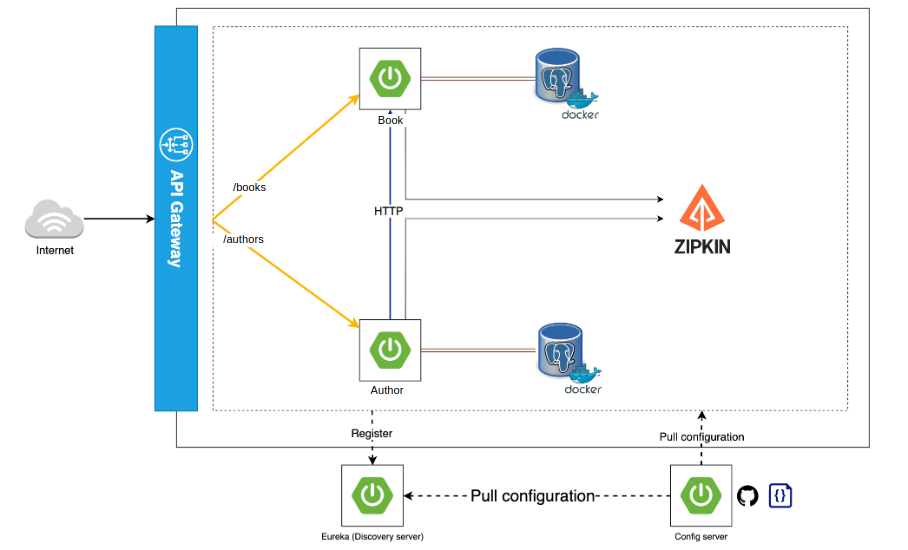

# Microservices Demo Project

Personal project to have hands-on understanding of microservices architecture.
The project consists of an API Gateway, Config Server, Discovery Server, and two microservices: Books and Authors.
Adapted from a project by BOUALI Ali.

## Table of Contents

- [Getting Started](#getting-started)
    - [Prerequisites](#prerequisites)
    - [Installation](#installation)
- [Project Components](#project-components)
    - [API Gateway](#api-gateway)
    - [Config Server](#config-server)
    - [Discovery Server](#discovery-server)
    - [Book Microservice](#book-microservice)
    - [Author Microservice](#author-microservice)
- [Inter-Service Communication](#inter-service-communication)
    - [Using OpenFeign](#using-openfeign)
- [Distributed Tracing](#distributed-tracing)
    - [Using Zipkin](#using-zipkin)
- [License](#license)
- [Acknowledgements](#acknowledgements)

## Getting Started
To build on local machine for development and testing purposes.

### Prerequisites
- JDK 17 or later
- Maven
- Docker

### Installation
1. Starts Postgres + Zipkin (no need for pgadmin => I prefer to use DBeaver locally to view the postgreSQL connection):
docker-compose up

ps: In order to have data, an init sql script is used in the docker-compose to populate the databases (Author + Book)

2. Build the microservices (maven projects)

3. Start the microservices in the folowing:
- discovery Server ==> eureka ==> 8761
- Book ==> 8091
- Author ==> 8071
- gateway ==> 8222

#### To do :
- externalize configuration.
- create a script to launch the docker-compose, built the microservices and run them in the right order
- For cloud deployment : put all the microservices in a separated docker container

## Project Components
### API Gateway
The API Gateway serves as the single entry point for all client requests, managing and routing them to the appropriate microservices.
### Config Server
The Config Server centralizes configuration management for all microservices, simplifying application maintenance and consistency across environments.
### Discovery Server
The Discovery Server provides service registration and discovery, enabling seamless service-to-service communication within the microservices ecosystem.
### Book Microservice
Simple microservices with basic fonctionalities
### Author Microservice
Simple microservices with basic fonctionalities

## Inter-Service Communication
### Using OpenFeign
This project demonstrates inter-service communication using OpenFeign, a declarative REST client that simplifies service-to-service communication within the microservices ecosystem.

## Distributed Tracing
### Using Zipkin
Zipkin = Zipkin is a distributed tracing system that helps monitor and troubleshoot latency issues in microservices architectures. It captures timing data for requests as they propagate through different services, allowing you to visualize and analyze request flows.

## License
This project is licensed under the [MIT License](see LICENSE).

## Acknowledgements
- [OpenFeign](https://github.com/OpenFeign/feign)
- [Zipkin](https://zipkin.io/)
- [Spring Cloud Netflix](https://spring.io/projects/spring-cloud-netflix)
- [Microservices project by BOUALI Ali](https://github.com/ali-bouali/springboot-3-micro-service-demo)